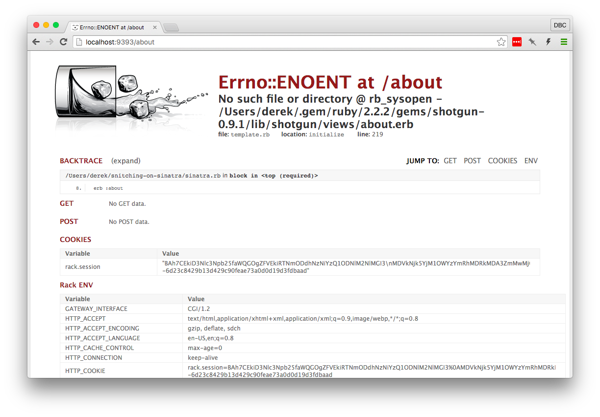

## Interlude: Restarting That Script, Though...
Having to restart our application every time we make a change is tedious.
Thankfully, solutions for this annoyance exist. A couple options to solve this
problem are the <a href="https://github.com/rtomayko/shotgun" target="_blank">shotgun</a>
and <a href="https://github.com/alexch/rerun" target="_blank">rerun</a> gems. 

We'll be using the `shotgun` gem. Install it with

```bash
$ gem install shotgun
```

> :flashlight: *If you're using <a href="https://github.com/sstephenson/rbenv" target="_blank">rbenv</a>, 
> you'll need to run `rbenv rehash` to reload commands you've installed with a gem 
> (like `shotgun`). If you're using rbenv, run `rbenv rehash` before continuing.*

`shotgun` provides a handful of ways to run web applications. Since our current
application only uses one file to declare our routes, we have been starting our
server with `ruby sinatra.rb`. `shotgun` allows us to use a very similar syntax:
`shotgun sinatra.rb`. Instead of needing to restart your application every time
you make a change, `shotgun` will automatically reload the necessary code each 
time you make a change.

Let's start shotgun now and make sure everything is working properly!

```bash
shotgun sinatra.rb
```

:mag: The output looks pretty similar with a few additions:

```
== Shotgun/Thin on http://127.0.0.1:9393/
Thin web server (v1.6.3 codename Protein Powder)
Maximum connections set to 1024
Listening on 127.0.0.1:9393, CTRL+C to stop
```

> :flashlight: *Shotgun takes less than a second to reload the server, but if you 
> change a file and immediately refresh the page, you may need to reload your 
> browser again to see your changes reflected.*

Now you will rarely need to manually restart your server process while 
developing your application!

> :mag: Notice that `shotgun` says that it's listening on `127.0.0.1:9393`. 
> When we ran `ruby sinatra.rb` previously, it told us that the server was 
> running on `localhost:4567`. `127.0.0.1` is an IP address that points to 
> localhost, making localhosh and `127.0.0.1` equivalent. `9393` is the port 
> that shotgun runs a web server on instead of `4567`.

### Try it!
Point your browser to 
<a href="http://localhost:9393/about" target="_blank">http://localhost:9393/about</a>
again and let's make sure everything is still working! 

**If everything looks as you expect it, head to [Part 2](part2.md)! If not, read 
on.**


## If it's not working, here's something to try!
Unexpectedly, `shotgun` sometimes doesn't work as an exact replacement for 
`ruby sinatra.rb`. You might see an error like this:



The good news is that we've seen an error message like this
before. The bad news is that we already created a file named `about.erb` in the
`views` directory. Our `shotgun`-run Sinatra just can't find it.

Sinatra has a <a href="http://www.sinatrarb.com/configuration.html#views---view-template-directory">`views` configuration setting</a> 
that we can use, given the current file, to enforce that Sinatra looks for views 
where we want it to. Add the following line to your `sinatra.rb` file, after 
your `require`:

```ruby
set :views, File.join(File.dirname(__FILE__), "views")
```

This tells sinatra to look for the `views` directory *in the current directory*
of the current file (`__FILE__`). Restarting `shotgun` shouldn't be necessary
and if you refresh the "about" page, we're back to our friendly message.

## If it's still not working, try `rerun`
`rerun` is another gem that will automatically reload your server after files
have been changed. You can install it with `gem install rerun` and run it using
`rerun sinatra.rb`.
