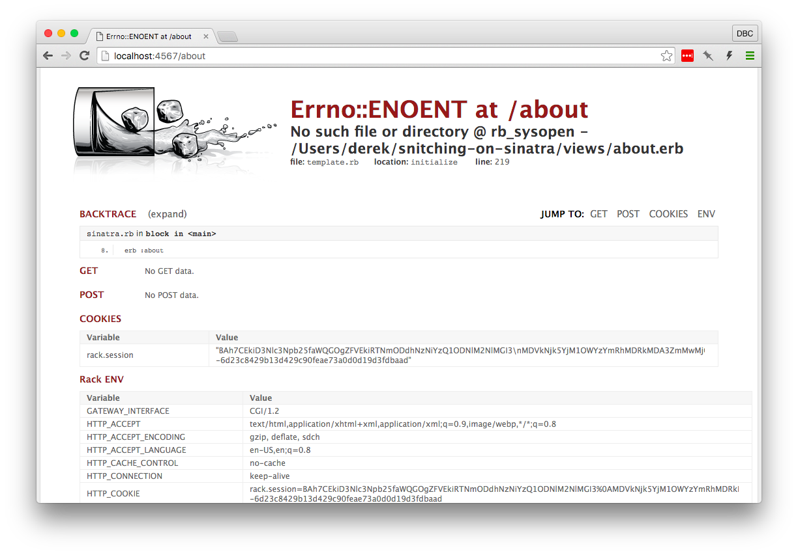
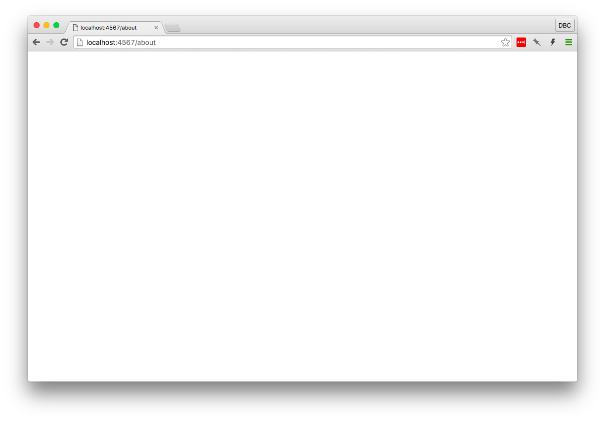
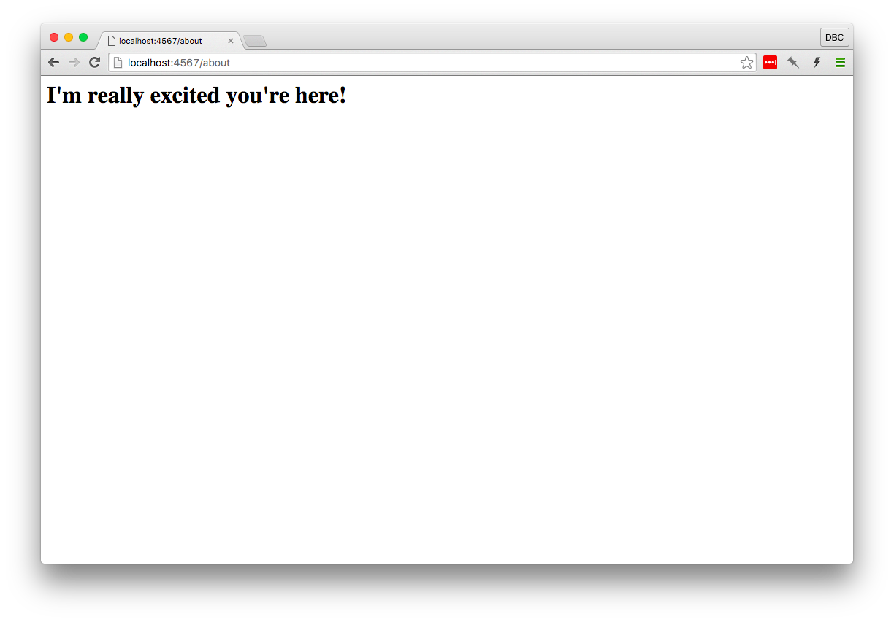

# Snitching on Sinatra

<a href="http://www.sinatrarb.com" target="_blank">Sinatra</a> is a small
Domain-Specific language (or DSL; a "language" that is used for a specific
purpose) for creating web applications quickly.

## Emoji Key
A quick note about emoji use in this part of the tutorial. To keep noise to a 
minimum, I'll only use a couple emoji:

* :mag: to indicate something you should read/notice. I'll use this one when you
  should notice something in your terminal.
* :flashlight: to say "hey, this is an insight you may have missed!"

### Code snippets
Since this is a code-along tutorial, individual text you'll need to enter in the
terminal or a file is demarcated as `code block text`. 

However, once in a while I still want to show text that is `code block formatted`
but that you don't have to enter yourself. Text indcluded in a code block for
you to *read* but not to type in will be indicated with the aforementioned :mag:.

**In a nutshell, code blocks indicate something to consciously type unless 
indicated with :mag:**

# The Beginning
If you haven't already, install the sinatra gem:

```bash
$ gem install sinatra -v '~> 1.4.6'
```

> :flashlight: *What's with that `~>` syntax? We're telling `gem` to install sinatra 
> version greater than or equal to `1.4.6`, but limiting which versions it will 
> install to patch releases greater than `1.4.6`. So `1.4.7` might be installed 
> in the future, but `1.4.5` won't be. Why `1.4.6`? Sinatra 1.4.5 had a bug that 
> prevented sinatra from displaying errors to the browser.*

Create a new ruby file (let's call it `sinatra.rb`, but it could really be
called anything):

```bash
$ touch sinatra.rb
```

and open it in your editor. At the top of this file, we'll need to include the
sinatra library.

```ruby
require 'sinatra'
```

Note that this is simply loading a library, code (ruby in this case) that
defines functionality that a developer might want to use.

# Watching It Fail
Before we code more, let's check out what happens when we just load Sinatra in
our file.  Run your Sinatra application by typing `ruby sinatra.rb` in your
terminal. 

:mag: Your terminal will respond with something like

```
== Sinatra (v1.4.6) has taken the stage on 4567 for development with backup from Thin
Thin web server (v1.6.2 codename Doc Brown)
Maximum connections set to 1024
Listening on localhost:4567, CTRL+C to stop
```

This tells us some really useful things:
* Sinatra is running on a particular port. We ran `ruby sinatra.rb` without
  specifying a port or a specific web server, so Sinatra automatically runs a
  web server on port `4567`. This will become useful soon.
* Sinatra is using the Thin web server to serve the application.
* We can hit `CTRL+C` at any time to stop the server.

If you'll remember, our application doesn't have anything in it yet. We created
a ruby file and used `require` to load the Sinatra library. When we ran
`sinatra.rb`, Sinatra launched a web server to serve web content on port `4567`.

Open your browser and go to <a href="http://localhost:4567" target="_blank">http://localhost:4567</a>.
What happened?


While you're developing an application, if Sinatra can't find a route it will
respond with a helpful error message. You'll become very familiar with **Sinatra
doesn't know this ditty** (Sinatra's
<a href="https://en.wikipedia.org/wiki/HTTP_404" target="_blank">404 Page</a>
while running locally) as you develop more Sinatra applications. It also tells
us what to add to our application to tell Sinatra that this route exists.

# Our First Routes
Go back to the terminal and hit `CTRL-C`. This will stop the server from running
and return us to a shell prompt. Open `sinatra.rb` in your editor and add this
to the file:

```ruby
get '/' do
  "Hello world!"
end
```

Now when we start the server again (with `ruby sinatra.rb`) and visit
<a href="http://localhost:4567" target="_blank">http://localhost:4567</a>
in the browser, "Hello world!" should show up in the browser!


We've created a "route" &mdash; the "root" route, which we can declare with a
slash (`/`) &mdash; so when we visit that route in the browser, the browser uses
the HTTP GET method to request information from our local server. The server
responds with the text "Hello world!"

Let's add another route:

```ruby
get '/about' do
  "A little about me."
end
```

*Note: When running a Sinatra application using `ruby sinatra.rb`, you have to
restart the script each time you make a change*

Now when we request the `/about` route &mdash; by visiting
<a href="http://localhost:4567/about" target="_blank">http://localhost:4567/about</a>
in the browser &mdash; the text "A little about me." is displayed.


# What Gets Rendered?
Our previous examples have only had one line in each route. It's worth noting,
however, that the *last* line of the block is what Sinatra tries to render to
the browser. Given this route

```ruby
get '/about' do
  "A little about <b>me</b>."
  "<h1>I'm really excited you're here!</h1>"
end
```

if we restart our script and visit 
<a href="http://localhost:4567/about" target="_blank">http://localhost:4567/about</a>
in the browser, the only thing displayed on the page is "I'm really excited 
you're here!", since that string was returned from the block. You may have also
noticed that the last line has an HTML tag in it, which the browser will render.

The browser will render HTML tags in the last string of the route's block just
fine, but trying to put multiple HTML tags in one string isn't very sustainable.
Lucky for us, Sinatra has a built-in way to create view files separate from 
controller files. 


# Views
To make creating views easier, we can tell Sinatra to run a specified file 
through the 
<a href="http://ruby-doc.org/stdlib-2.2.2/libdoc/erb/rdoc/ERB.html" target="_blank">ERB</a>
templating library.

Let's change our "about" route to render an ERB view instead. Update the route
to call the `erb` method like so:

```ruby
get '/about' do
  erb :about
end
```
*Note: Don't forget to restart your script! This will probably get pretty 
annoying, but will fix this irritation soon enough!*

then load it in the browser by visiting 
<a href="http://localhost:4567/about" target="_blank">http://localhost:4567/about</a>



Sinatra has thrown an exception. That's good! That's something we can use.

:mag: Let's read the error message line by line, starting at the top next to the
spilled tumbler. `Errno::ENOENT at /about` looks
intimidating, but the next line actually tells us exactly what we need to know:

```bash
No such file or directory @ rb_sysopen - /Users/derek/workspace/snitching-on-sinatra/views/about.erb
```

Your path may look a little different, but it's the last two parts of that path
(`/views/about.erb`) that look potentially useful. We're trying to *make* a view,
so `views` is useful. And that `about.erb` looks similar to what we put next
to `erb` in our controller file.

As an aside &mdash; keeping in mind that Sinatra is just a DSL written in Ruby &mdash;

```ruby
erb :about
```

is just a method call. We could call it with `erb(:about)` and it would work
the same way.

What this error is telling us is that Sinatra is looking in a specific place
when we give the `erb` method a symbol (`:about`) as its first argument.
Sinatra looks in the same directory as our source file (`sinatra.rb`) for a
directory named `views` containing a file with the same name as the symbol we
gave it *plus* the extension `.erb`.

In a nutshell, we have to create that directory and that file. In the terminal:

```bash
$ mkdir views
$ touch views/about.erb
```

Then you can restart your script and reload your browser.



Yay! It didn't fail! But there's nothing showing up, either. 
ERB is a way to create templates with executable code. It allows you to use 
string interpolation with ERB-specific tags. Let's open the view file 
(`views/greeting.erb`) and add to it. Since we're displaying something in a web 
browser, let's put some HTML in our view:

```html
<h1>I'm really excited you're here!</h1>
```

Restart that script (ugh!), refresh your browser, and you should see a nice 
greeting!



Sinatra's `erb` method *returns a string*, which means we can run it at the end
of a route block and expect the method's output to render to the browser.

Before we move on to using variables and sharing data between controllers and
views, [let's make sure we don't have to keep manually restarting our script](part1-5.md).
