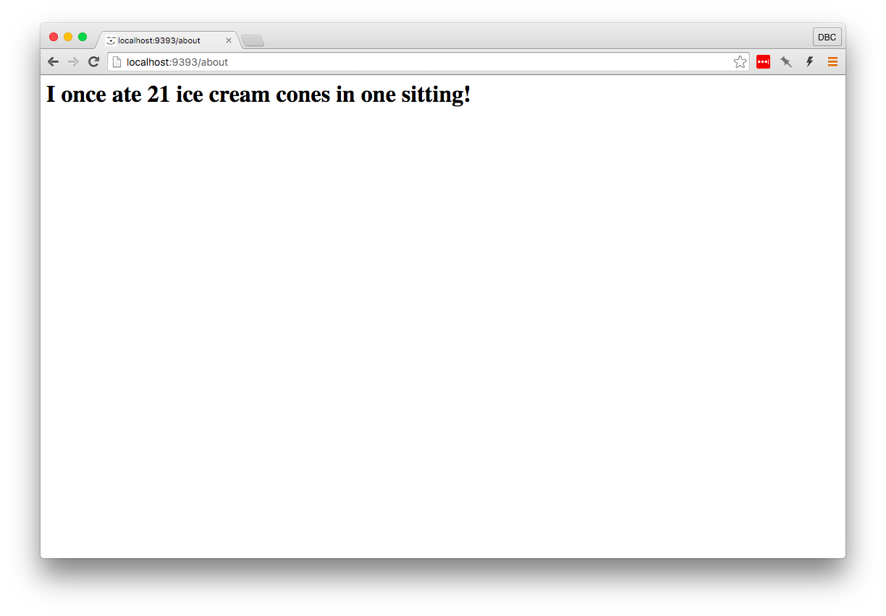
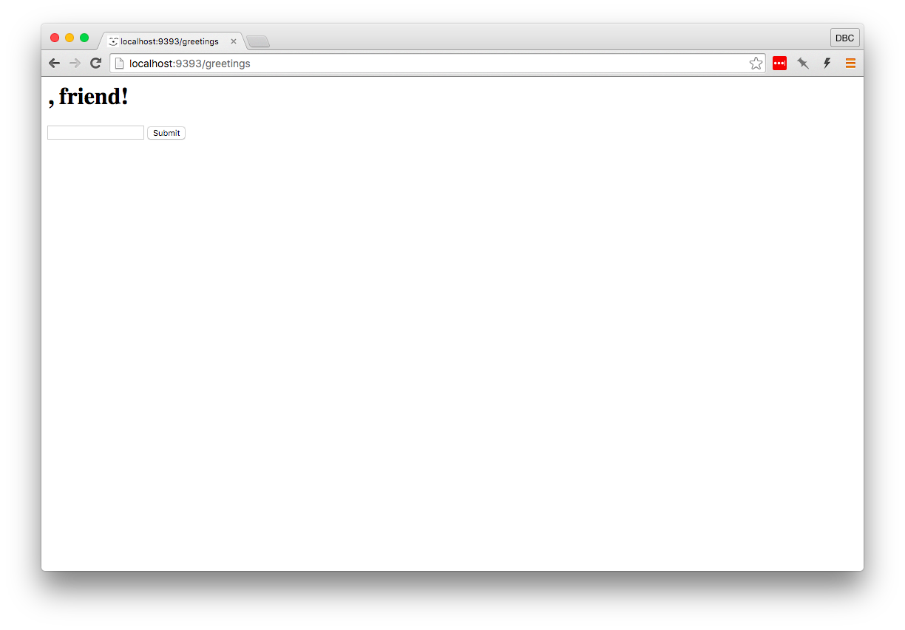
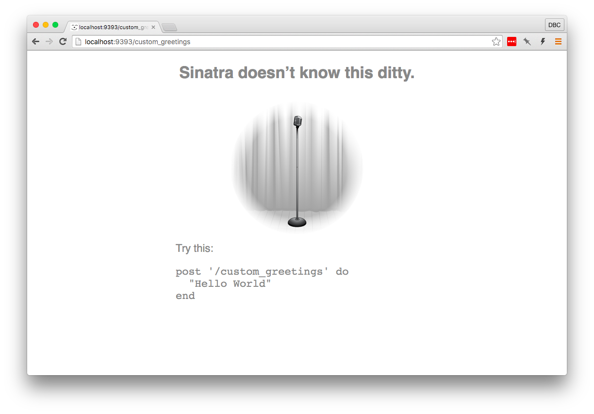
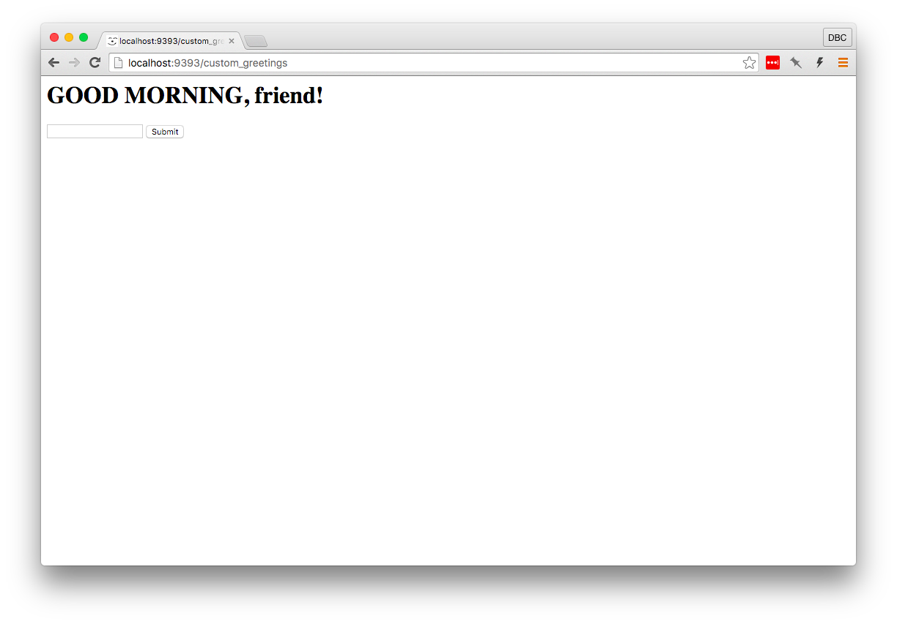
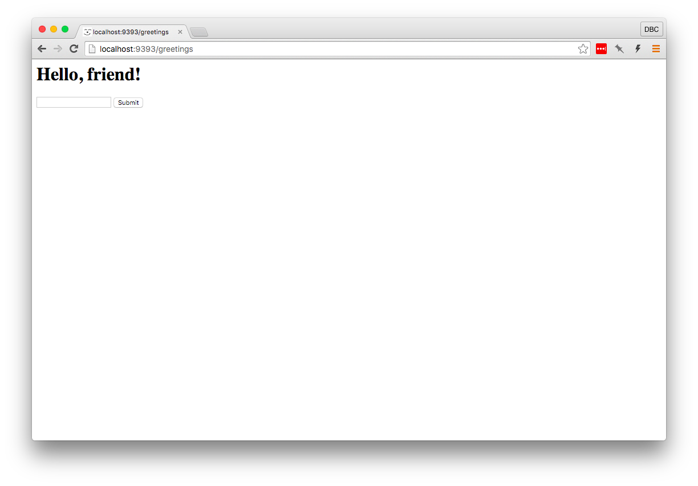

# Sharing Data Between Controllers and Views
Let's spice up our About page with some simple dynamic content. In your 
controller, replace the `get '/about'` route to add something dynamic:

```ruby
get '/about' do
  @ice_cream_cones = rand(30) + 1
  erb :about
end
```


Edit the view file to look like this

```ruby
<h1>I once ate <%= @ice_cream_cones %> ice cream cones in one sitting!</h1>
```

and refresh the page.



The `<%= @ice_cream_cones %>` erb tag was replaced with a random number, 
courtesy of the `@ice_cream_cones` instance variable we set in the controller.

An instance variable set in a route's block will be available to the view that
has been rendered by that block. That's a pretty complicated sentence, so let's
try to break that down.

Setting `@ice_cream_cones` in this block means we can access `@ice_cream_cones`
in `about.erb`. Instance variables set in a block can be accessed in a view 
rendered using the `erb` method *within than block*. `erb` is a method that is 
most commonly called with a symbol (`:about` in this case). It executes ruby 
code contained in special tags.

> :flashlight: An ERB tag with an equals sign (`<%= %>`) displays the result
> of the code inside the begin and end tags, while an ERB tag without an equals
> sign (`<% %>`) doesn't display the result to the page.

# URL Parameters
As developers, we frequently need to receive information from the user of our
application. In Sinatra, there are multiple ways to do this. In your ruby file,
add this route:

```ruby
get '/greetings/:name' do
  params[:name]
end
```

Then point your browser to
<a href="http://localhost:9393/greetings/eve" target="_blank">http://localhost:9393/greetings/eve</a>.
The browser will respond with the parameter sent in. Try changing "eve" to
something else, like "saskatchewan". Sinatra will still match this route and
will display whatever text is entered after the last slash.

Notice that we used `params` in the route body. `params` is a hash that Sinatra
provides to allow access to data that has been sent from the browser. Also
notice that the `:name` portion of the route definition (`get '/greetings/:name'`)
is the same as the `:name` key of the `params` hash.

Since `params` is a hash, we can use standard ruby code such as string
interpolation to manipulate or display information that has been sent in. Let's
modify the previous route to be a little more friendly.

```ruby
get '/greetings/:name' do
  "Hey #{params[:name]}!"
end
```

You can also add multiple parameters to be replaced in a route:

```ruby
get '/cities/:city/greetings/:name' do
  "Hey #{params[:name]}! Welcome to the #{params[:city]} greeting page!"
end
```

Sinatra calls these "named parameters," since it uses the text after the symbol
as that parameter's key in the `params` hash. When accessing a route, you can
replace the named parameters with text.

These will all match the route we've defined above:

<a href="http://localhost:9393/cities/Chicago/greetings/Michael" target="_blank">http://localhost:9393/cities/Chicago/greetings/Michael</a><br>
<a href="http://localhost:9393/cities/Los%20Angeles/greetings/Anne" target="_blank">http://localhost:9393/cities/Los%20Angeles/greetings/Anne</a><br>
<a href="http://localhost:9393/cities/Pluto/greetings/mickey" target="_blank">http://localhost:9393/cities/Pluto/greetings/mickey</a><br>

# POST
We can already send information to the server by utilizing named parameters,
but that's not very convenient for users of our website. Let's build in some
interactivity so people who visit our beautiful, welcoming site can get their
own custom greeting!

A convenient way for users to send information to our site is by using an HTML
form. Create a view file called `views/greetings.erb` and add a form:

```html
<h1><%= @greeting %>, friend!</h1>

<form action="/custom_greetings" method="post">
  <input type="text" name="greeting">
  <input type="submit">
</form>
```

> :flashlight: Notice that this view is displaying something on the page using
> ERB tags as well as displaying the form.

Add a new route to your controller file that will render the view you just
created:

```ruby
get '/greetings' do
  erb :greetings
end
```

When you visit your <a href="http://localhost:9393/greetings" target="_blank">greetings page</a>,
you should see an input with a submit button as well as a pretty ugly greeting.



Enter some text in the text input and click the Submit button. I'm going to enter
the text "GOOD MORNING."



The structure of this error looks really familiar. We saw this when we first
started and we hadn't yet declared the route we were trying to access. Sinatra is
kind enough to tell us exactly the route it "matched": `post '/custom_greetings'`.
This is the route we used for the HTML form above.

Our previous requests were HTTP GET requests, which generally *retrieve* data
from the server. We had our form submit a POST request &mdash; another HTTP method we
can use &mdash; to perform an action on the server.

When we submit a POST request, a request "body" is sent to the server. In our
form, the body that got sent was the `input` tag we put in our form.

In order for Sinatra to respond to the route our form is POSTing data to, we
need to add a route that matches it. Add the following route to `sinatra.rb`:

```ruby
post '/custom_greetings' do
  @greeting = params[:greeting]
  erb :greetings
end
```

For now, we're just going to render the same view again, `greeting.erb`.

Go back to the main greeting page where the form is being displayed
(<a href="http://localhost:9393/greetings" target="_blank">http://localhost:9393/greetings</a>) 
and submit the form again.



## Let's work through all that's happening here.

### Rendering the form
1. From our browser, we make a GET request to the `/greetings` route on our 
   local computer. That is, we enter `http://localhost:9393/greetings` into the
   browser's URL bar and hit `Enter`, which makes the initial HTTP request.
2. Sinatra finds a matching route and runs the code in the corresponding code 
   block. In most cases, the last line will be a string (the `erb` method 
   returns a string), so Sinatra will send that string back to the browser to be 
   displayed.
3. The browser converts the HTML it receives to something humans would rather read.


### Submitting the form
1. From our browser, we enter text into the input displayed on the page and 
   click the "Submit" button.
2. The browser sends the data we entered to a different route using a POST request.
3. Sinatra once again finds a matching route (this time for `/custom_greetings`)
   and runs the corresponding code block. We're calling `erb :greetings` again,
   so Sinatra will send a string back to the browser to be rendered.
4. The browser converts the HTML it receives to something humans would rather read.

# Clean it up
We're setting the `@greeting` instance variable in the `post '/custom_greetings'` 
route, but as we've seen, the page doesn't look very nice when a custom greeting
hasn't been set. To solve that, let's add some code to display a default 
greeting if a custom greeting hasn't been set:

```html
<% if @greeting %>
  <h1><%= @greeting %>, friend!</h1>
<% else %>
  <h1>Hello, friend!</h1>
<% end %>

<form action="/custom_greetings" method="post">
  <input type="text" name="greeting">
  <input type="submit">
</form>
```

You may have noticed that the line `if @greeting` is preceded by `<%` instead of
`<%=` (without the "equals" sign). `<%=` evaluates Ruby code *and passes the value* 
of the expression through to the browser. `<%` evaluates Ruby code in the same 
way but *suppresses the value* of the expression from the browser. Feel free to
experiment with using `<%` and `<%=`.

Now if we load 
<a href="http://localhost:9393/greetings" target="_blank">the greetings page</a>
without submitting a custom greeting, we get a friendly default:



# Congratulations!

You built a web app! The concepts covered in this tutorial are the building
blocks of all web applications.

**If you're curious about how we might persist data in an application, head over
to <a href="part3.md">part 3</a> of this tutorial!**
